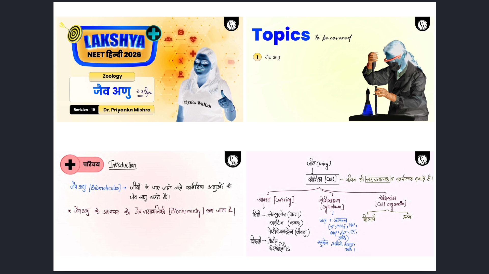

# ⚡ NoteForge — Smart PDF Stitcher

> Stitch class note slides into compact, print-ready A4 PDFs. Save paper & ink.



## 🎯 What is NoteForge?

NoteForge is a web app built for students who want to print their class notes (PDF slides) efficiently. It takes bulky slide-per-page PDFs and stitches multiple slides onto a single A4 page in a grid layout — saving up to **75% paper** and **80% ink**.

No signup. No watermark (unless you want one). No BS.

---

## ✨ Features

### Core
| Feature | Description |
|---------|-------------|
| 📐 Custom Grid Layouts | 6 layouts — `2×2`, `2×1`, `3×2`, `3×3`, `1×2`, `1×4` |
| 🎨 Smart Color Invert | Dark backgrounds → white. Saves ~80% ink |
| ✂️ Auto Whitespace Trim | Detects & removes unnecessary horizontal margins |
| 📄 Page Range Selection | Process only the pages you need with smart batch suggestions for large PDFs (40 pages/batch) |

### Customization
| Feature | Description |
|---------|-------------|
| 📏 Border Lines | Separator lines between slides for a clean printed look |
| #️⃣ Page Numbers | Auto page numbers (1/20 style) on every output page |
| 📝 Watermark | Diagonal watermark (name/subject) on every page |
| ☀️ Brightness & Contrast | Fine-tune brightness (50–150%) and contrast (50–200%) |

### UX
| Feature | Description |
|---------|-------------|
| 🌙 Dark / Light Theme | Toggle with auto-save preference |
| 📱 PWA (Installable) | Install as app on phone/desktop, works offline for cached pages |
| ⌨️ Keyboard Shortcuts | `Ctrl+U` upload, `Ctrl+G` generate, `Esc` cancel |
| 📊 Stats & History | Track conversions, slides processed, pages saved (stored locally) |

---

## 🖼️ Screenshots

| Dashboard | Stitch Tool |
|-----------|-------------|
|  |  |

---

## 🛠️ Tech Stack

- **Backend:** Python, Flask
- **PDF Processing:** PyMuPDF (fitz)
- **Image Processing:** Pillow, NumPy
- **Frontend:** Jinja2 templates, vanilla CSS/JS
- **PWA:** Service Worker + Web App Manifest
- **Deployment:** Vercel (serverless) / Docker

---

## 🚀 Getting Started

### Prerequisites
- Python 3.10+

### Local Setup

```bash
# Clone the repo
git clone https://github.com/divyanshu-builds-ui/Noteforge.git
cd Noteforge

# Install dependencies
pip install -r requirements.txt

# Run the app
python app.py
```

App runs at `http://localhost:5000`

### Docker

```bash
docker build -t noteforge .
docker run -p 5000:5000 noteforge
```

---

## 📁 Project Structure

```
Noteforge/
├── app.py              # Flask app with all routes & PDF processing logic
├── stitch_notes.py     # CLI script for quick local stitching
├── api/
│   └── index.py        # Vercel serverless entry point
├── static/
│   ├── style.css       # Global styles
│   ├── sw.js           # Service worker (PWA)
│   ├── manifest.json   # PWA manifest
│   └── icon-*.png      # App icons
├── templates/
│   ├── base.html       # Base layout
│   ├── index.html      # Dashboard
│   ├── stitch.html     # Main stitching tool
│   ├── features.html   # Features page
│   ├── how_it_works.html
│   ├── guide.html
│   ├── about.html
│   └── 404.html
├── Dockerfile
├── vercel.json
└── requirements.txt
```

---

## 🌐 Deployment

### Vercel (Serverless)

Already configured via `vercel.json`. Just connect the repo to Vercel and deploy.

```bash
vercel --prod
```

### Docker (Self-hosted)

```bash
docker build -t noteforge .
docker run -d -p 5000:5000 noteforge
```

---

## 🧑‍💻 CLI Usage

For quick local stitching without the web UI:

```bash
python stitch_notes.py "path/to/your-notes.pdf"
```

Outputs a `*_stitched.pdf` in the same directory with 2×2 grid, inverted colors, and trimmed whitespace.

---

## ⚙️ Configuration

| Parameter | Default | Description |
|-----------|---------|-------------|
| `MAX_CONTENT_LENGTH` | 50 MB | Max upload file size |
| `A4_WIDTH × A4_HEIGHT` | 3508 × 2480 | A4 landscape at 300 DPI |
| `WHITESPACE_THRESH` | 240 | Threshold for whitespace detection |
| Max pages per batch | 40 | Large PDFs are split into batches |

---

## 📄 License

MIT

---

## 🙌 Contributing

PRs welcome! Feel free to open issues for bugs or feature requests.

---

Built with ⚡ by **Divyanshu Gupta**
